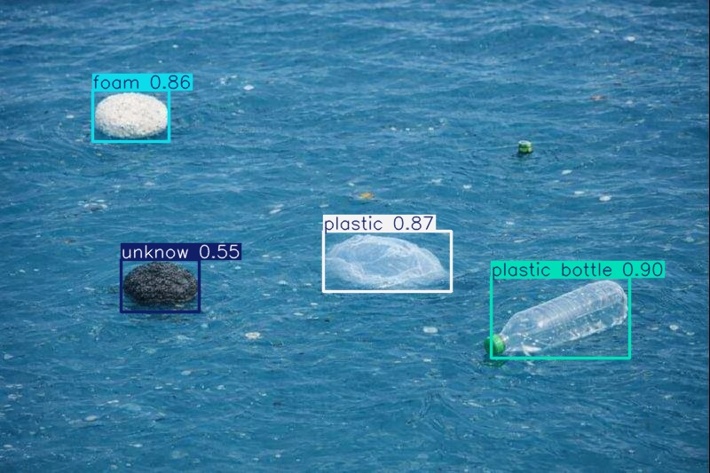

# Marine Debris Detection using YOLOv8

This project focuses on the automatic detection of marine debris using deep learning-based object detection models. The goal is to support environmental monitoring and mitigation efforts by enabling scalable, fast, and reliable identification of marine litter in images and videos.

The project was developed with a strong emphasis on reproducibility, modularity, and real-world deployment, including API-based inference and containerized infrastructure.

Project example: https://drive.google.com/file/d/1y3Zpn7-5Af5lJI3uy33AfLyxVoyq9PQg/view?usp=sharing

---
<p align="center">
  
  <br>
  <em>Example of marine debris detection using YOLOv8.</em>
</p>
---
For tracking example: https://drive.google.com/file/d/1_8-O5DvoBDJ75acQPwMXMiykhJyUklYd/view?usp=sharing
---

## 🌊 Environmental Motivation

Marine debris poses severe threats to marine ecosystems, biodiversity, and human activities. Plastics and other waste materials contribute to:

- Habitat degradation and biodiversity loss  
- Ingestion and entanglement of marine fauna  
- Long-term pollution through microplastics  
- Economic impacts on fisheries and tourism  

Automated detection systems based on computer vision allow large-scale monitoring using aerial imagery, coastal cameras, and videos, reducing manual effort and increasing spatial and temporal coverage.

---

## 🎯 Project Objective

- Detect specific categories of marine debris in images and videos using: https://app.roboflow.com/galvesvlv/marine-debris-i2ge3-3hnmu/2
- Train and fine-tune a YOLOv8 object detection model (ultralytics framework)
- Serve the trained model through an inference API (FastAPI)
- Provide a frontend interface for interactive inference (Streamlit)
- Ensure reproducibility through Docker-based infrastructure (Docker Compose)

---

## 🧠 Why YOLOv8?

YOLOv8 was chosen due to the following technical advantages:

- Strong performance in detecting **small objects**, common in marine debris imagery  
- Robust results with **moderate-sized datasets**
- Fast inference suitable for near real-time applications
- Simple and well-documented **fine-tuning pipeline**
- Fully Python-based ecosystem with mature tooling

These characteristics make YOLOv8 well-suited for environmental monitoring scenarios with limited labeled data and deployment constraints.

Useful links:
- https://github.com/ultralytics/ultralytics/blob/main/ultralytics/cfg/default.yaml
- https://github.com/ultralytics/ultralytics/blob/main/ultralytics/cfg/models/v8/yolov8.yaml

---

## 📂 Project Structure

The repository is organized as follows:

```text
.app/
│ └── Frontend application files

.config/
│ └── Global configuration files and environment variables

.data/
│ └── Dataset in YOLOv8 format
│ Source: https://app.roboflow.com/galvesvlv/marine-debris-i2ge3-3hnmu/2/images

.inference/
│ └── Inference pipeline and API
│ - Serves the trained YOLOv8 model
│ - Connects backend inference with Streamlit frontend

.preprocessing/
│ └── Dataset exploration and preprocessing studies
│ - Class distribution
│ - Image statistics
│ - Exploratory analysis

.test/
│ └── Test assets for inference
│ - Sample images
│ - Sample videos

train_models/
│ └── Training scripts and experiments
│ - YOLOv8 training versions
│ - Hyperparameter optimization using Optuna

.weights_yolov8/
│ └── Trained YOLOv8 model weights

docker-compose.yml
│ └── Docker Compose file for infrastructure orchestration

ModelYoloV8.ipynb
│ └── Notebook used for model training (GPU-based environment)
```

- Note that the real training was done in Google Colab environment because of GPU local restrictions.
  - The notebook called `ModelYoloV8.ipynb` was used for that. It also have some other experiments to build this project. 
- We provide specific documentation in all the other folders.
- The `requirements.txt` file in the project root can be used to train the object detection models locally. Alternatively, model training can be performed using GPU resources in a Google Colab environment.

## 🚀 Running the Project

To run the project locally, navigate to the repository root directory and start the services using Docker Compose:

```bash
docker compose up --build -d